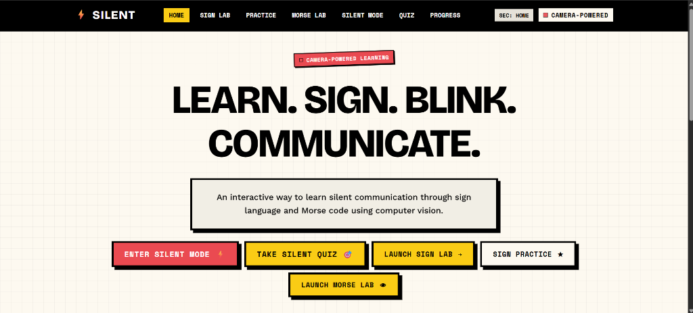
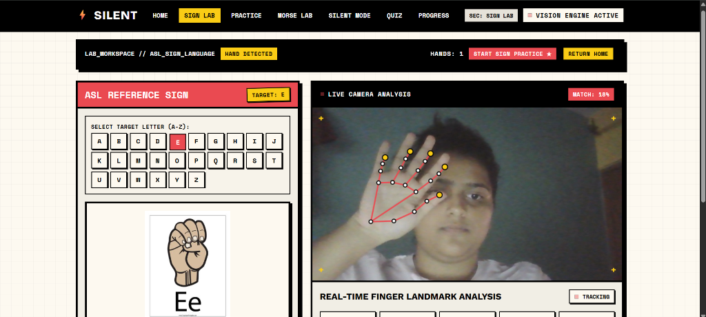
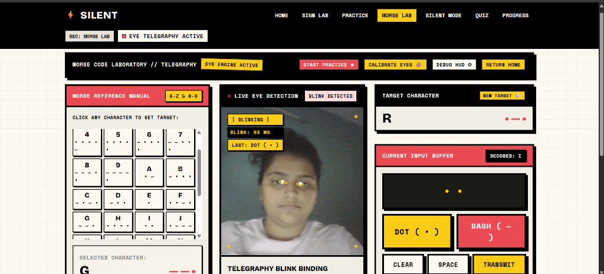
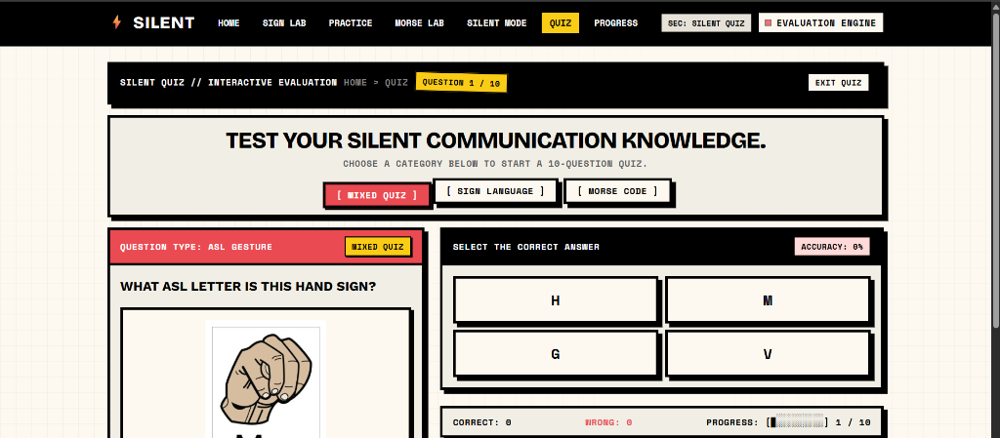
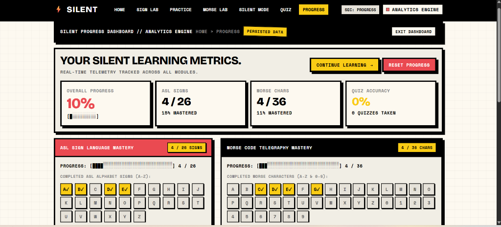

# ⚡ SILENT — Sign Language & Morse Code Lab

> **Interactive Silent Communication Training Instrument & Ocular Telegraphy Engine**  
> 🌐 **Live Demo**: [https://ishikasarvesh.github.io/silent-sign-morse/](https://ishikasarvesh.github.io/silent-sign-morse/)

---

## 📸 Screenshots

| Landing Page | ASL Sign Lab |
| :---: | :---: |
|  |  |

| Morse Code Lab | Silent Quiz |
| :---: | :---: |
|  |  |

| Progress Dashboard |
| :---: |
|  |

---

## 📖 Overview

**SILENT** is an interactive web application that enables non-verbal communication training and accessibility testing through real-time computer vision in the browser:

- **ASL Hand Gesture Recognition**: Learn and practice A–Z American Sign Language alphabet gestures with real-time 21-landmark hand skeletal tracking and vector pose scoring.
- **Ocular Telegraphy (Morse Code by Eye Blinks)**: Transmit Morse code dots (`.`) and dashes (`-`) using webcam eye aspect ratio (EAR) auto-calibration.
- **Unified Silent Mode**: Combine hand gestures and eye blinks into hands-free text messages with anti-duplicate stabilization and command controls (`SPACE`, `BACKSPACE`, `CLEAR`).
- **Interactive Evaluation Quiz**: Test sign language and Morse knowledge with 10-question evaluation quizzes.
- **Progress Analytics**: Persistent tracking of mastered signs, Morse characters, and quiz scores via browser `localStorage`.

---

## 🛠️ Tech Stack & Architecture

- **Frontend**: HTML5, Vanilla JavaScript (ES6+ App Router), Custom Vanilla CSS3
- **Design System**: Neo-Brutalist aesthetic (High contrast borders, hard shadows, warm ivory `#FAF6EE`, `#ea4a51`, `#facc15`)
- **Computer Vision Pipeline**:
  - [MediaPipe Hands](https://cdn.jsdelivr.net/npm/@mediapipe/hands/hands.js) (21 3D Hand Landmarks)
  - [MediaPipe Face Mesh](https://cdn.jsdelivr.net/npm/@mediapipe/face_mesh/face_mesh.js) (468 Facial Landmarks for EAR Eye Blink Telegraphy)
- **Typography**: Google Fonts (*Bricolage Grotesque*, *Work Sans*, *Space Mono*)

---

## 🚀 How to Run Locally

Because SILENT runs natively in the browser using client-side WebAssembly, no build step or node module installation is required!

1. **Clone the Repository**:
   ```bash
   git clone https://github.com/ishikasarvesh/silent-sign-morse.git
   cd silent-sign-morse
   ```
2. **Serve static files**:
   ```bash
   # Using Node npx serve
   npx serve .

   # Or using Python static server
   python -m http.server 8000
   ```
3. Open `http://localhost:8000` in Google Chrome, Microsoft Edge, or Firefox and grant webcam access when prompted.

---

## 📁 Project Structure

```text
SILENT/
├── index.html            # Main HTML layout, view routes & modals
├── style.css             # Neo-Brutalist design tokens & responsive styles
├── app.js                # Vision engines, tracking loops & app router
├── assets/
│   ├── signs/            # 26 reference ASL sign images (A.jpg - Z.jpg)
│   └── screenshots/      # App UI preview screenshots
├── content.md            # Release documentation
└── README.md             # Project documentation
```

---

## 🔒 Privacy & Security

- **100% Client-Side Processing**: All webcam tracking and vision model inferencing happen entirely on your device via WebAssembly. No video data or images are ever transmitted to external servers.

---

## 🙏 Credits & Acknowledgments

- **Google MediaPipe**: Real-time machine learning solutions for computer vision.
- **Google Fonts**: *Bricolage Grotesque*, *Work Sans*, and *Space Mono*.
